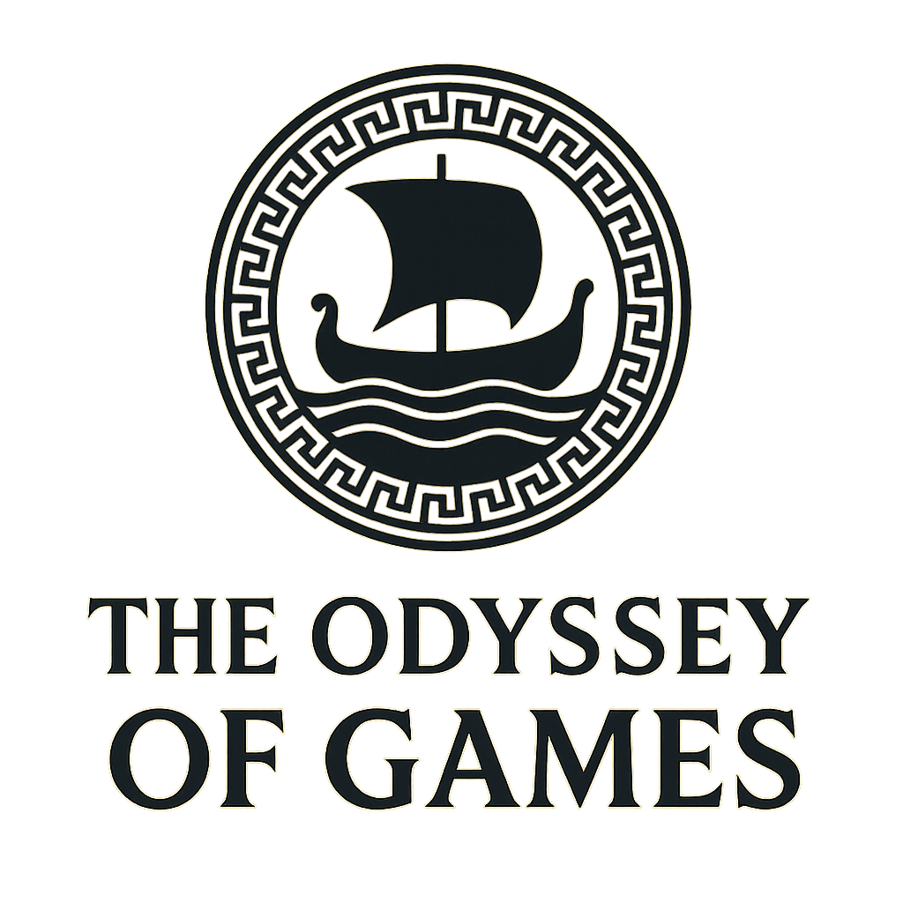
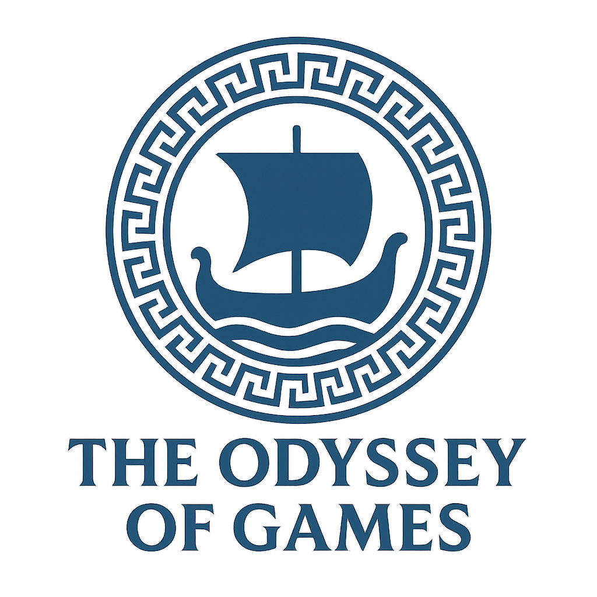
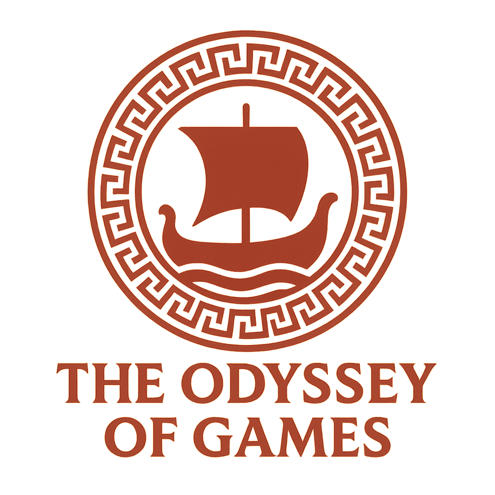

# The Odyssey of Games



## 🎯 Visão Geral

**The Odyssey of Games** é uma plataforma educativa e de entretenimento que combina jogos clássicos de diferentes culturas em uma experiência narrativa interconectada. O projeto visa preservar e ensinar sobre a rica história dos jogos tradicionais através de uma jornada épica inspirada na Odisséia de Homero.

## 🏛️ Estrutura do Projeto

```
TheOdysseyOfGames/
├── docs/                           # Documentação do projeto
│   ├── assets/                     # Imagens e recursos visuais
│   └── project_details.md          # Especificações detalhadas
├── TheOdysseyOfGamesApp/           # Aplicativo móvel (React Native)
├── theodysseyofgamesweb/           # Site profissional (React)
├── backend/                        # API e backend (Node.js)
└── README.md                       # Este arquivo
```

## 🎮 Jogos Incluídos

### Civilizações Antigas
- **Senet** (Egito Antigo) - O jogo dos mortos
- **Go** (China/Japão) - Estratégia territorial milenar
- **Mancala** (África) - Jogo de sementes e estratégia
- **Chaturanga** (Índia) - Ancestral do xadrez
- **Royal Game of Ur** (Mesopotâmia) - Corrida real

### Culturas Medievais e Clássicas
- **Hanafuda** (Japão) - Cartas florais tradicionais
- **Nine Men's Morris** (Europa Medieval) - Alinhamento estratégico
- **Hnefatafl** (Vikings) - Defesa do rei
- **Pachisi** (Índia) - Corrida real
- **Patolli** (Asteca) - Jogo de apostas sagrado

## 🎨 Identidade Visual

### Paleta de Cores
- **Primária**: Dourado (#FFD700)
- **Secundária**: Azul Egípcio (#0066CC)
- **Neutras**: Branco (#FFFFFF), Cinza (#333333)

### Logos Culturais
Cada civilização possui sua própria variação do logo principal, incorporando elementos visuais autênticos:

-  **Egípcia** - Hieróglifos e Olho de Horus
-  **Asteca** - Padrões e cores tradicionais
-  **Japonesa** - Sakura e elementos zen

## 📱 Funcionalidades

### Aplicativo Móvel
- **Modo Aventura**: Narrativa épica através das civilizações
- **Modo Clássico**: Jogos individuais com IA e multiplayer
- **Modo Torneio**: Competições temáticas globais
- **Sistema Social**: Comunidade e compartilhamento

### Site Profissional
- **Landing Page**: Apresentação do projeto
- **Blog**: Artigos sobre história e cultura dos jogos
- **Comunidade**: Fóruns e eventos
- **Suporte**: Tutoriais e FAQ

## 🚀 Tecnologias

### Mobile
- **React Native** com TypeScript
- **Redux** para gerenciamento de estado
- **Firebase** para backend e autenticação

### Web
- **React.js** com hooks modernos
- **Material-UI** para componentes
- **Node.js** para API

### DevOps
- **GitHub Actions** para CI/CD
- **Docker** para containerização
- **AWS/Vercel** para deploy

## 📋 Roadmap de Desenvolvimento

### Fase 1: Fundação (Semanas 1-4) ✅
- [x] Configurar repositório GitHub
- [x] Criar estrutura básica do projeto
- [x] Documentação inicial
- [x] Assets visuais

### Fase 2: Núcleo de Jogos (Semanas 5-12) 🔄
- [ ] Implementar 3-5 jogos principais
- [ ] Sistema de IA para oponentes
- [ ] Interface de usuário básica
- [ ] Tutoriais interativos

### Fase 3: Modo Aventura (Semanas 13-20) 📅
- [ ] Narrativa principal
- [ ] Sistema de progressão
- [ ] Ambientes temáticos
- [ ] Integração jogos/história

### Fase 4: Sistema Social (Semanas 21-24) 📅
- [ ] Multiplayer online
- [ ] Sistema de amigos
- [ ] Fóruns e chat
- [ ] Compartilhamento

### Fase 5: Monetização (Semanas 25-28) 📅
- [ ] Loja virtual
- [ ] Sistema de assinaturas
- [ ] Anúncios recompensados
- [ ] Torneios pagos

### Fase 6: Site e Marketing (Semanas 29-32) 📅
- [ ] Site profissional completo
- [ ] Blog e conteúdo
- [ ] SEO e analytics
- [ ] Materiais de marketing

### Fase 7: Lançamento (Semanas 33-36) 📅
- [ ] Testes finais
- [ ] Beta testing
- [ ] Publicação nas stores
- [ ] Campanha de lançamento

## 🤝 Contribuição

Este projeto está em desenvolvimento ativo. Contribuições são bem-vindas!

### Como Contribuir
1. Fork o repositório
2. Crie uma branch para sua feature (`git checkout -b feature/AmazingFeature`)
3. Commit suas mudanças (`git commit -m 'Add some AmazingFeature'`)
4. Push para a branch (`git push origin feature/AmazingFeature`)
5. Abra um Pull Request

## 📄 Licença

Este projeto está licenciado sob a Licença MIT - veja o arquivo [LICENSE](LICENSE) para detalhes.

## 📞 Contato

**The Odyssey of Games Team**
- Email: contact@theodysseyofgames.com
- Website: [theodysseyofgames.com](https://theodysseyofgames.com)
- GitHub: [@GabrielJaccoud](https://github.com/GabrielJaccoud)

---

**Que esta jornada seja tão épica quanto a Odisséia que a inspirou!** 🚀

## 🏆 Métricas de Sucesso

### Técnicas
- Tempo de carregamento < 3 segundos
- Performance 60+ FPS
- Taxa de crash < 0.1%

### Negócio
- 100K+ downloads no primeiro ano
- 20+ minutos de engajamento diário
- 4.5+ estrelas nas app stores

### Educacionais
- Impacto mensurável no aprendizado cultural
- Parcerias com instituições educacionais
- Feedback positivo de educadores

